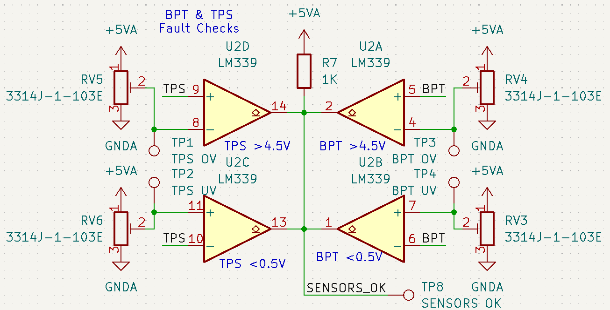

# BSPD

## Theory of Operation

### Definitions
| Term | Definition|
|-|-|
| BSPD | Brake System Plausibility Device |
| TPS | Throttle Position Sensor |
| BPT | Brake Pressure Transducer |
| ETB | Electronic Throttle Body |
| ETC | Electronic Throttle Control |

### Relevant Rules
- IC.4.8 (BSPD)
- IC.9.1.1.c (Shutdown Circuit Components)

### Flowchart

### Description
The BSPD is a relatively basic circuit, It's primary purpose is to detect a stuck throttle, or failures of either BPT or TPS.

The BPT & TPS hardware failure logic can found below. U2A & U2B form a window comparator to validate that BPT is within the given ranges (nominally 0.5V to 4.5V), this not only detects out of range values but also loss of signal of the BPT due to a pulldown on the BPT (not shown). Similarly, U2D & U2C form the same circuit for the TPS. When a fault becomes active, the respective comparator(s) pull SENSORS_OK low. RV3-6 can be used to tune the minimum & maximum thresholds for both the BPT & TPS.

The hardware stuck throttle logic can be found below. It closely mirrors the sensor failure logic but with a one sided comparator to allow for tuning of the 10% TPS threshold and the "hard braking" BPT threshold (IC.4.8.3.a).

The time delay logic can be found below. Looking at the left half of this circuit, R10 and C3 form an RC circuit with SENSORS_OK. We are interested in the draining behavior of this RC circuit (as it begins draining once a fault is detected and propegated to SENSORS_OK). R10 and C3 are selected to give a nominal 100ms Tau. R12 & R13 were selected to model 1 Tau of voltage drop in a drainage configuration. The fault will be propegated to BSPD_OK if SENSORS_OK has been low for more then the 100ms Tau. D4 is added to improve startup time & start latching avoidance ([see more here](#startup)). This circuit is mirrored for the panic braking fault using U1C. More information about the calculations behind the fault time delay can be found [here](#fault-time-delay).

Shown below is the latching logic for the overall BPSD_OK signal. When a fault occurs and is fully propegated, BSPD_OK is pulled low, this turns on Q2, which then supplies +V to Q1 and continues to pull BSPD_OK low. This ensures that even if the fault is no longer present, BSPD_OK will be latched low. More information about the startup latching avoidance see [here](#startup). 

## Mounting
The image below shows the mounting location of each header and the mounting M3 in the middle. The mounting M3 is designed to bolt into a SMD standoff on the carrier board.

## Fault Time Delay
The resistor values for 1_RC were selected based off the falling time of RC circuits after one time constant (because SENSORS_OK or PANIC_BRAKE is pulled low during a fault). It approximates e-1 and nominally is 0.3% lower. With 10% accuracy resistors the range of values is as follows:

| Condition  | Value (V) |
| ------- | ----|
| Mininum  | 2.25 |
| Nominal  | 2.5 |
| Maximum  | 2.75 |

The time to propagate the fault assuming 10% accuracy components is as follows when given the equation $t = -RCln(\frac{V_{th}}{V_{cc}})$:

| Fault | Condition  | Time (s) |
| - | ------- | ----|
| SENSORS_OK | Mininum  | 0.048 |
| SENSORS_OK | Nominal  | 0.069 |
| SENSORS_OK | Maximum  | 0.097 |
| PANIC_BRAKE | Mininum  | 0.484 |
| PANIC_BRAKE | Nominal  | 0.693 |
| PANIC_BRAKE | Maximum  | 0.966 |

### Simulation & Validation

The following simulation was run to verify the time delay of the fault propagation. 

| Trace Color | Meaning  |
| - | ------- |
| Green | Fault Active |
| Red | SENSORS_OK |
| Orange | SENSORS_OK RC |

The simulation matched quite well against what was measured for Rev A. 

| Trace Color | Meaning  |
| - | ------- |
| Blue | SENSORS_OK |
| Yellow | SENSORS_OK RC |

## Startup
During startup, assuming no fault, SENSORS_OK will be pulled up to 5V through a 1K pullup. It will charge the RC circuit at the negative input of U1C. Because RD4 << RR10 (and likewise for PANIC_BRAKE's RC circuit), this can be simplified to a RC circuit with the following values:
- Vcc = 5 - Vf
- Vf = 0.3V
- R = 1k&#937;
- C = 10uF
- $t = -RCln(1- \frac{V_{th}}{V_{cc}})$:

| Condition  | Time (ms) |
| ------- | ----|
| Mininum  | 5.3 |
| Nominal  | 7.6 |
|  Maximum  | 10.6 |

The RC circuit that R19 and C5 create are designed to keep the Q2's $V_{gs} > V_{gs(th)}$ during startup. Because the RC circuits for SENSORS_OK and PANIC_BRAKE are charging during startup, BSPD_OK will be pulled down until they have passed the 1_RC threshold voltage. That time is covered in the previous table. Worst Case, $V_{s}$ must stay below  $V_{gs(th)}$ until both fault RC circuits have passed 1_RC. This again uses $t = -RCln(1- \frac{V_{th}}{V_{cc}})$ with $V_{th} = 0.8$ 

$V_{gs(th)} = -0.8V$ (which is the maximum gate source threshold voltage for the BSS84) 

| Condition  | Time (ms) |
| ------- | ---- |
| Mininum  | 14.1 |
| Nominal  | 17.4 |
|  Maximum  | 21.1 |

After a maximum of 21.1ms the output fault signal will be able to be latched. The minimum "prime" time of 14.1ms is greater then the maximum time (10.6ms) for the RC circuits to reset on startup.

## Sensors
### TPS
The selected [ETB](https://www.bosch-motorsport.com/content/downloads/Raceparts/Resources/pdf/Data%20Sheet_68749835_Electronic_Throttle_Body.pdf) is not clear on the output signals of it's TPSs. Below is the measured values for idle and wide open throttle.

| Condition  | TPS1 (V) | TPS2 (V) |
| ------- | ---- | - |
| 0% / Idle  | 0.5? | 4.5? |
| 100% / WO  | 4.5? | 0.5? |

## Errata

### Rev A

The following errata were found in Rev A of the BSPD, corrected, and tested before being documented:

- Q2 was placed in the schematic with the wrong orientation. The drain and source were swapped. This was corrected in Rev B.
- A misreading of the datasheet for the LM339 for output logic made the schematic logic/labeling incorrect.
  - It was assumed that when + > -, the output would be pulled low, this is incorrect, the LM339 pulls the output low when + < -.
  - PANIC_BRAKE (Rev A) logic was inverted and thus renamed to PANIC_BRAKE (Rev B+).
    - Due to this, D1 was required to be flipped as now the fault is active high.
  - Over & undervoltage detection for BPT & TPS was assigned incorrectly (was tuned via potentiometer to flip to the correct logic). These were swapped in Rev B to correct the logic.
  - As SENSORS_OK is fault is active low, pins 8 & 9 for U1D were swapped to correct the logic.

## Notes

### Rev A

- This was built to test functionality and validation of circuit design. Pots were used to tune thresholds before sensors were finalized
- This revision used 5 extended components which increased the cost of the board, most should be removed/replaced in future revisions.
  - LM339, ESDA-05N, BSS84, POTs (3314J-1-103E), BAT43W, C1 & C2 (150nF)
- Many test points were used to validate the circuit, most can be removed in future revisions.

## Electrical Characteristics

### Rev A

| Parameter | Description  | Typical Value | Unit |
| ------- |- | ---- | - |
| tSOK_FAULT | Time to propagate SENSORS_OK condition | 25 | ms |
| tSOK_RECOVERY | Time required to recover from SENSORS_OK condition | 11 | ms |
| tHB_FAULT | Time to propagate PANIC_BRAKE condition | 473 | ms |
| tHB_RECOVERY | Time required to recover from PANIC_BRAKE condition | 4 | ms |

These parameters were measured by hand, and are not guaranteed to be accurate for all frequencies & duty cycles. They are provided as a rough estimate of the circuit's behavior.
