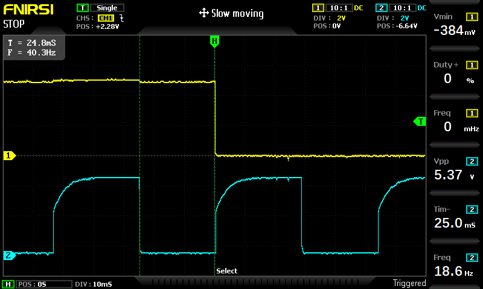

# Scope Screenshot Descriptions

### Running Fault

| Channel | Description |
| ------- | ---- |
| CH2 | BSPD_OK |
| CH1 | Latch RC |

### Startup Fault

| Channel | Description |
| ------- | ---- |
| CH2 | BSPD_OK |
| CH1 | Latch RC |

### Running Sensor OK Fault

| Channel | Description |
| ------- | ---- |
| CH2 | SENSORS_OK |
| CH1 | SENSORS_OK RC |

### Running Hard Braking Fault

| Channel | Description |
| ------- | ---- |
| CH2 | PANIC_BRAKE |
| CH1 | PANIC_BRAKE RC |

### Sensors OK RC response to fault

| Channel | Description |
| ------- | ---- |
| CH2 | SENSORS_OK |
| CH1 | SENSORS_OK RC |

### Running Sensor OK Fault Timing

| Channel | Description |
| ------- | ---- |
| CH1 | BSPD_OK |
| CH2 | SENSORS_OK |

### Running Hard Braking Fault Timing

| Channel | Description |
| ------- | ---- |
| CH1 | BSPD_OK |
| CH2 | HARD_BRAKING (1Hz 50% DC) |